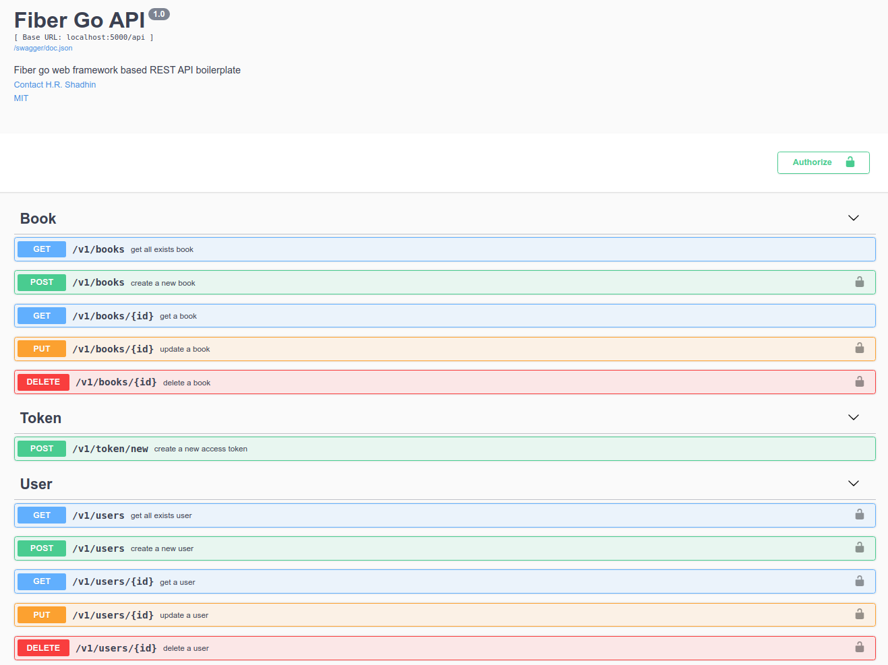

# Fiber Go Boilerplate

<p align="center">
  <a href="https://golang.org/doc/go1.16">
    
  </a>
  <a href="https://github.com/gofiber/fiber/releases">
    
  </a>
  <a href="https://goreportcard.com/report/github.com/hrshadhin/fiber-go-boilerplate">
    
  </a>
  <a href="https://gocover.io/github.com/hrshadhin/fiber-go-boilerplate">
    
  </a>
  <a href="https://github.com/hrshadhin/fiber-go-boilerplate/actions?query=workflow%3ASecurity">
    
  </a>
  <a href="https://opensource.org/licenses/MIT">
    
  </a>
</p>

Is a production-ready golang based boilerplate application with Fiber Go web framework.
For any fiber go application, just clone the repo & rename the application name.

[Fiber](https://gofiber.io/) is an Express.js inspired web framework build on top of Fasthttp, the fastest HTTP engine for Go. Designed to ease things up for **fast** development with **zero memory allocation** and **performance** in mind.

## Tools & Libraries used
- [Golang 1.16+](https://golang.org/doc/go1.16)
- [PostgreSQL](https://www.postgresql.org/)
- [Docker](https://www.docker.com/get-started)
- [Fiber framework](https://github.com/gofiber/fiber)
- [JWT](https://github.com/form3tech-oss/jwt-go)
- [Swagger docs](https://github.com/swaggo/swag)
- [golang-migrate](https://github.com/golang-migrate/migrate)
- [gosec](https://github.com/securego/gosec)

## ⚡️ Quick start
- Install **`docker`**, **`golang-migrate`** & **`swag`**
- Rename `.env.example` to `.env`
- Run project by this command:
  ```bash
  make docker.run
  ```
- Visit **`http://localhost:5000`** or **`http://localhost:5000/swagger/`**
- Stop `make docker.stop`



## 📦 Used packages

| Name                                                                  | Version   | Type       |
| --------------------------------------------------------------------- | --------- | ---------- |
| [gofiber/fiber](https://github.com/gofiber/fiber)                     | `v2.7.1`  | core       |
| [gofiber/jwt](https://github.com/gofiber/jwt)                         | `v2.2.1`  | middleware |
| [arsmn/fiber-swagger](https://github.com/arsmn/fiber-swagger)         | `v2.6.0`  | middleware |
| [stretchr/testify](https://github.com/stretchr/testify)               | `v1.7.0`  | tests      |
| [dgrijalva/jwt-go](https://github.com/dgrijalva/jwt-go)               | `v3.2.2`  | auth       |
| [joho/godotenv](https://github.com/joho/godotenv)                     | `v1.3.0`  | config     |
| [jmoiron/sqlx](https://github.com/jmoiron/sqlx)                       | `v1.3.3`  | database   |
| [jackc/pgx](https://github.com/jackc/pgx)                             | `v4.11.0` | database   |
| [sirupsen/logrus](https://github.com/sirupsen/logrus)                 | `v1.8.1`  | logging    |
| [swaggo/swag](https://github.com/swaggo/swag)                         | `v1.7.0`  | utils      |
| [google/uuid](https://github.com/google/uuid)                         | `v1.2.0`  | utils      |
| [go-playground/validator](https://github.com/go-playground/validator) | `v10.5.0` | utils      |

## 🗄 Project structure

### /app

**Folder with business logic only**. This directory doesn't care about what database driver you're using.

- `/app/controller` folder for functional controller (used in routes)
- `/app/dto` Data Transfer Objects(DTO) folder for transform data before sent to API clients
- `/app/model` folder for describe business models and methods of your project
- `/app/repository` folder for perform database operations for models of your project

### /cmd
**Main applications for this project.**

The directory name for each application should match the name of the executable you want to have (e.g., `/cmd/server` `/cmd/cron`).
Don't put a lot of code in the application directory. If you think the code can be imported and used in other projects,
then it should live in the `/pkg` directory.

### /docs

**Folder with API Documentation.**

This directory contains config files for auto-generated API Docs by Swagger, screenshots
and any other documents related to this project.

### /pkg

**Folder with project-specific functionality.** This directory contains all the project-specific code tailored only for your business use case.

- `/pkg/config` folder for configuration functions
- `/pkg/middleware` folder for add middleware (Fiber built-in and yours)
- `/pkg/route` folder for describe routes of your project
- `/pkg/validator` folder with validation functions

### /platform

**Folder with platform-level logic**. This directory contains all the platform-level logic that will build up the actual project,
like setting up the database, logger instance and storing migrations, seeds(demo data).

- `/platform/database` folder with database setup functions (by default, PostgreSQL)
- `/platform/logger` folder with better logger setup functions (by default, Logrus)
- `/platform/migrations` folder with migration files (used with [golang-migrate/migrate](https://github.com/golang-migrate/migrate) tool)
- `/platform/seeds` folder with demo data for application rapid setup. mostly **sql** scripts

## ⚙️ Configuration

```ini
# .env
# APP settings:
APP_HOST="0.0.0.0"
APP_PORT=5000
APP_READ_TIMEOUT=30
APP_DEBUG=false

# JWT settings:
JWT_SECRET_KEY="super_secret_here"
JWT_SECRET_KEY_EXPIRE_MINUTES_COUNT=120

# Database settings:
DB_HOST=fibergb-postgres
DB_PORT=5432
DB_USER=dev
DB_PASSWORD=dev
DB_NAME=fiber_go_api
DB_SSL_MODE=disable
DB_DEBUG=true
DB_MAX_OPEN_CONNECTIONS=3
DB_MAX_IDLE_CONNECTIONS=1
DB_MAX_LIFETIME_CONNECTIONS=10
```

## 🔨 Docker development

- Install **`docker`**, **`docker-compose`** & **`golang-migrate`**
- Rename `.env.example` to `.env`
- Start db container `docker-compose up db`
- Run migrations `make migrate.up`
- Now start api server with hot reloading `make docker.dev`
- Visit **`http://localhost:5000`** or **`http://localhost:5000/swagger/`**

## 🔨 Local Development

- Install **`PostgreSQL`** **`golang  >= 1.16`** **`golang-migrate`** **`gosec`** & **`swag`**
- Rename `.env.example` to `.env` and fill it with your environment values
- Migrate db & seed some demo data
  ```bash
  make migrate.up
  make seed
  ```
- Run project by this command:
  ```bash
  make run
  ```
- Visit **`http://localhost:5000`** or **`http://localhost:5000/swagger/`**
- Check `Makefile` for more commands
  ```bash
  # drop migration
  make migrate.down

  # force migration to specific version
  migrate.force

  # run test
  make test
  ...
  ```

## ⚠️ License

[MIT](https://opensource.org/licenses/MIT) &copy; [H.R. Shadhin](https://github.com/hrshadhin)
